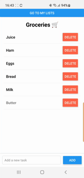
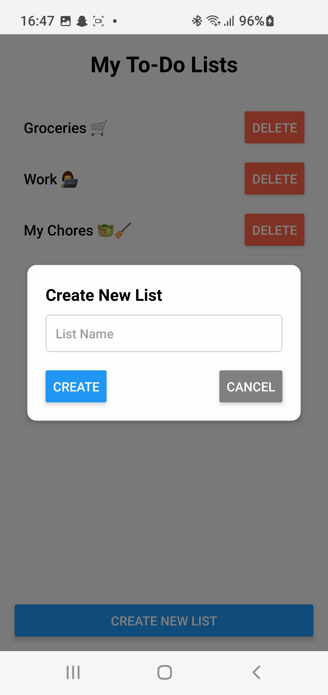
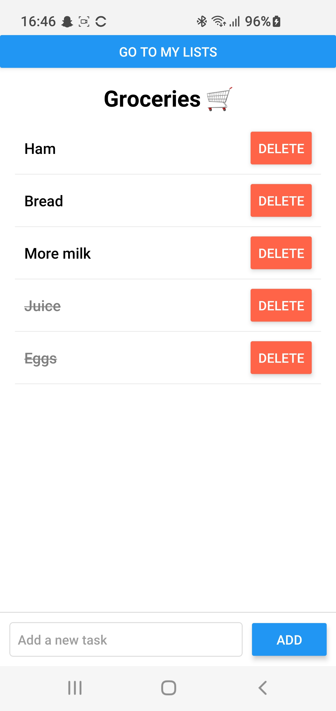

# Simple To-Do List App

Welcome to the Simple To-Do List app! This app helps you to manage your tasks efficiently.

## Screenshots

Here are some screenshots of the app in action:

<table>
  <tr>
    <td style="text-align:center;">
      <h4>Main App Usecase (GIF)</h4>
      
    </td>
    <td style="text-align:center;">
      <h4>Create New To-Do Lists (JPG)</h4>
      
    </td>
  </tr>
  <tr>
    <td style="text-align:center;">
      <h4>Keep Organized With Different To-Do Lists (JPG)</h4>
      
    </td>
    <td style="text-align:center;">
      <h4>View, Complete, Delete, And Add Tasks To Your Lists (JPG)</h4>
      
    </td>
  </tr>
</table>

## Installation and execution

Follow these steps to get the app up and running:

### Prerequisites

To run this app, you'll need the following installed on your system:

- **Node.js**: Ensure that Node.js is installed. You can download it from [here](https://nodejs.org).
- **Android Studio**: For Android development and the Android Emulator. You can download it from [here](https://developer.android.com/studio).
  - **Android SDK** and **Android Virtual Device (AVD)** should also be installed via Android Studio for the emulator to work.
- **JDK**: Java Development Kit (JDK 11 or later) is required for Android builds.
- **React Native CLI**: If you don’t have the React Native CLI installed globally, you can install it via npm:
  ```bash
  npm install -g react-native-cli
   ```

### Installation

1. Clone the repository:
    ```bash
    git clone https://github.com/jensmjahle/Simple-ToDo-List-for-Android-IOS
    ```
> **Alternative:** Download the zipfile and extract it [Press to download](https://github.com/jensmjahle/Simple-ToDo-List-for-Android-IOS/archive/refs/heads/main.zip)
     
    

2. Navigate into the project directory:
    ```bash
    cd Simple-ToDo-List-for-Android-IOS
    ```

3. Install dependencies:
    ```bash
    npm install
    ```

4. **Set up Android Studio and Emulator**:
    - Open Android Studio and set up an Android Virtual Device (AVD) or connect a physical Android device via USB.
    - To verify that the Android emulator is set up correctly, run:
      ```bash
      adb devices
      ```
    This should list the connected emulator or device.

5. **Start the app on Android**:
    Once the emulator is running (or a physical device is connected), run the following to start the app:
    ```bash
    npm run android
    ```

### iOS (Not Implemented Yet)

- iOS support is not currently implemented in this project. If you want to build for iOS, please ensure you have Xcode installed and use the following command (if it's ever implemented):
    ```bash
    npm run ios
    ```

## Features

- Add, edit, and delete tasks.
- Mark tasks as completed.
- View completed tasks with a strikethrough effect.

## License

This project is licensed under the MIT License.
