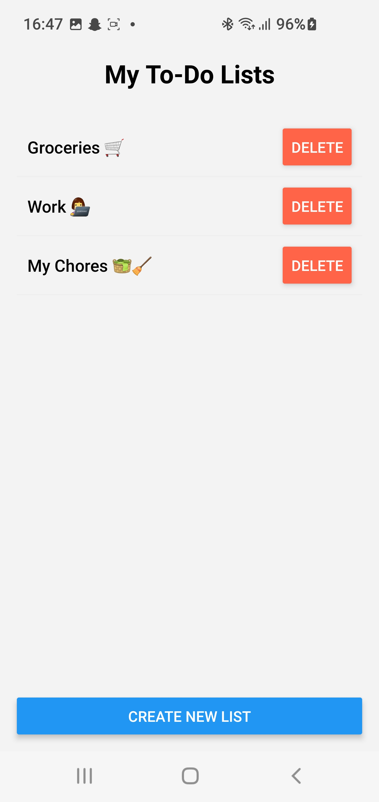

# Simple To-Do List App

Welcome to the Simple To-Do List app! This app helps you to manage your tasks efficiently.

## Screenshots

Here are some screenshots of the app in action:

<table>
  <tr>
    <td style="text-align:center;">
      <h4>Main App Usecase (GIF)</h4>
      
    </td>
    <td style="text-align:center;">
      <h4>Create New To-Do Lists (JPG)</h4>
      
    </td>
  </tr>
  <tr>
    <td style="text-align:center;">
      <h4>Keep Organized With Different To-Do Lists (JPG)</h4>
      
    </td>
    <td style="text-align:center;">
      <h4>View, Complete, Delete, And Add Tasks To Your Lists (JPG)</h4>
      
    </td>
  </tr>
</table>

## Installation

Follow these steps to get the app up and running:

1. Clone the repository:
    ```bash
    git clone https://github.com/jensmjahle/Simple-ToDo-List-for-Android-IOS
    ```

2. Install dependencies:
    ```bash
    npm install
    ```

3. Start the app:
    ```bash
    npm run android
    ```

## Features

- Add, edit, and delete tasks.
- Mark tasks as completed.
- View completed tasks with a strikethrough effect.

## License

This project is licensed under the MIT License.
